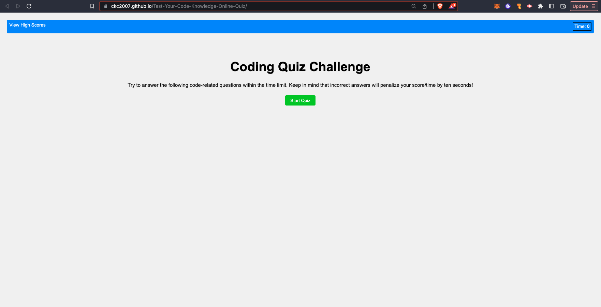
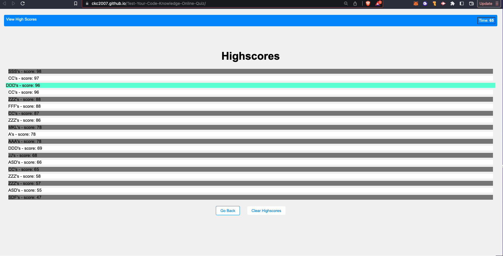
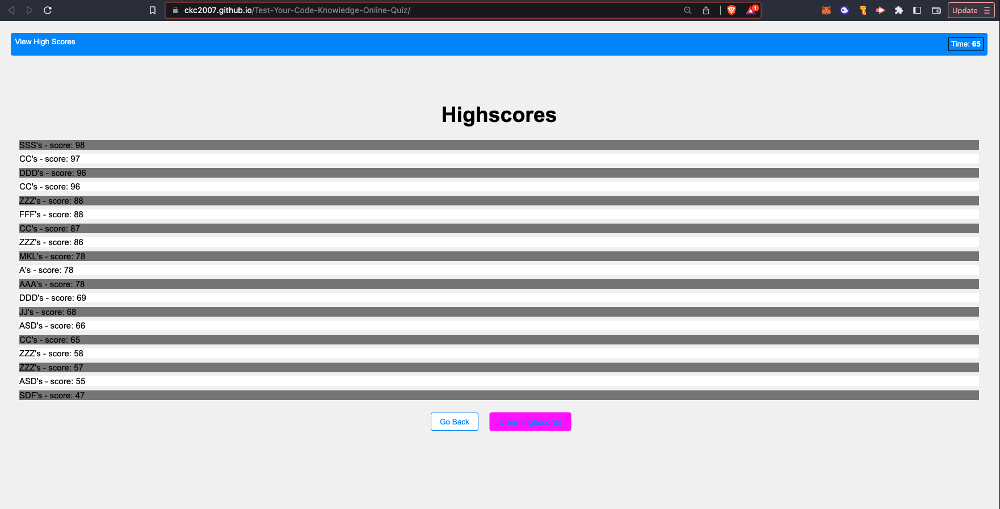

# "Test Your Code Knowledge" Online Quiz

A timed quiz on JavaScript fundamentals.

## Description

- Test your knowledge of JavaScript and compete against yourself or your friends to get the highest score!
- The test questions are custom-designed to review tricky details. Some are easier than others - don't get fooled!
- As a student of JavaScript, I want to be able to use this quiz as a virtual study session and gamified flashcard-style review.
- By implementing a timer, you must get to the correct answer quickly. A wrong answer will penalize your time. The score is your best time.
- This is not as easy as it seems...what will be your highest score?

## Table Of Contents

[Installation](#installation)
[Usage](#usage)
[License](#license)

## Installation

from VS Code:

- Please clone the repository
- Run the index.html file in your live server
- Or, visit the deployed page (link below)

## Usage

- When you first open the app, you will be able to see any previously saved local leaderboard information.
- You can start the timed quiz at anytime, view the leaderboard at any time, and will be shown a series of coding questions.
- When the timer runs out, or you have answered all the questions, you will be taken to the leaderboard where you will be prompted to save your name.
- You can see your highest scores and contine to practice by retaking the quiz.
- Clear your scores at any time.

## Screenshot / Video

Link to deployed site:
[https://ckc2007.github.io/Test-Your-Code-Knowledge-Online-Quiz/]

Deployed Site:

Score List:

## License

This project is licensed under the MIT license.

## Features

- Additional quesions will be added soon.
- Dynamic color changes as the timer reaches zero will be added.
- Timer difficulty will be an option soon.

## Questions

Please direct questions to the owner of this repository at ckc2007@gmail.com

Owner GitHub page:
[ckc2007](https://github.com/ckc2007).

## Credits

This README was created using the README generator app by ckc2007!
visit the GitHub page to try it out:
[README Generator app by ckc2007](https://github.com/ckc2007/README-Generator)
