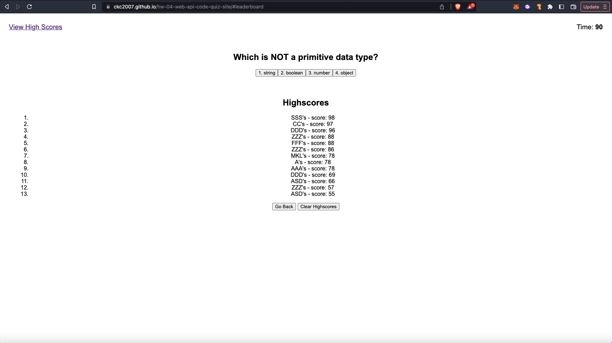
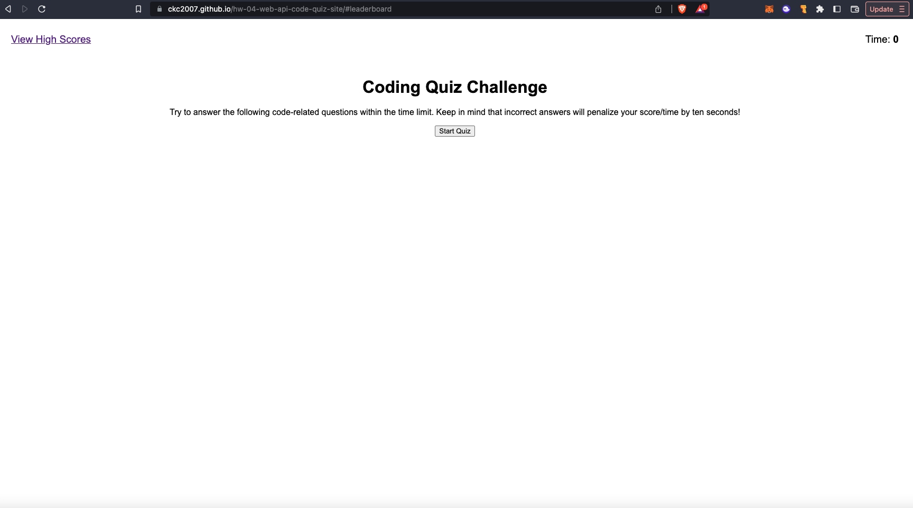

# hw-04-web-api-code-quiz-site

```
a timed quiz on javascript fundamentals that has a leaderboard!
```

## User Story

```
AS A coding student
I WANT to take a timed quiz that tests my knowledge on JavaScript Fundamentals
SO THAT I can have a fun way of tracking my progress against myself and my peers.
```

## Acceptance Criteria

```
GIVEN I am taking the coding quiz
WHEN I click the start button
THEN a timer starts a countdown and I am given the first question
WHEN I answer this question by clicking on the answer buttons
THEN I am taken to the next question
WHEN all questions are completed, or the timer reaches 0
THEN the game is complete
WHEN the game is complete
THEN I can save my initials and my score (best time)
```

## Deployed Page

[https://ckc2007.github.io/hw-04-web-api-code-quiz-site/#leaderboard]





```

The above is a screenshot of the deployed page

```

## Game Features

```
The timer will deduct 10 seconds for a wrong answer
You can see the leaderboard even if the quiz is in progress if you choose to click on the View High Scores link.
```

## Future Features

```
Other features that will be made available in the future may include:
- An answer key
- Dynamic coloring of the game field
- Animations for button actions
- A wider selection of questions
- A choice of how many questions to include
- A choice for easy, medium, hard
- A choice for how long the timer will last
- Badges for making a certain score
```
